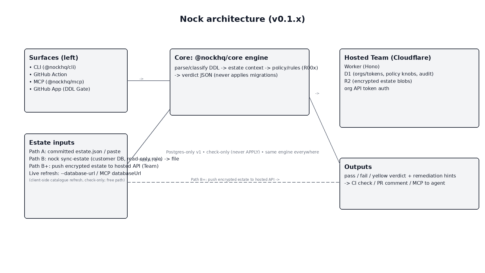

### Nock architecture diagram

- Edit source: `docs/architecture/nock-architecture.excalidraw`
  - Web: open `https://excalidraw.com` → Open → select the file
  - VS Code: install the “Excalidraw” extension and open the `.excalidraw` file directly
- Note: `.excalidraw` is JSON for editing (no GitHub preview). Prefer the PNG above for embeds.
- Also included: `docs/architecture/nock-architecture.svg` (GitHub‑safe SVG, inline attributes)

What it shows:
- Surfaces (CLI, GitHub Action, MCP, GitHub App) on the left
- Core engine (`@nockhq/core`) in the center: parse/classify DDL → estate context → policy/rules (R00x) → verdict JSON (never applies migrations)
- Estate inputs: Path A (committed `estate.json` / paste), Path B (`nock sync-estate` → file), Path B+ (push encrypted estate to hosted API), Live refresh (`--database-url` / MCP `databaseUrl`)
- Hosted Team (Cloudflare) on the right: Worker (Hono), D1 (orgs/tokens, policy knobs, audit), R2 (encrypted estate blobs), org API token auth
- Outputs: pass/fail/yellow verdict + remediation hints → CI check / PR comment / MCP to agent

Notes:
- Postgres-only v1
- Check-only (never APPLY)
- Same engine everywhere (CLI ≡ Action ≡ MCP ≡ App)
